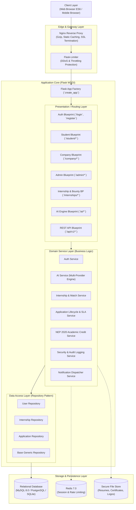

# TELEPORTAL Architecture & Engineering Specification

## 1. High-Level Architectural Overview

TELEPORTAL is built on an enterprise-grade **Application Factory Pattern** coupled with a decoupled **Repository-Service-Controller (RSC)** layered architecture. It ensures high cohesion, loose coupling, strict testability, and seamless scalability across diverse deployment targets (Docker, Kubernetes, AWS, Render).

---

## 2. Layer Responsibilities

### Presentation Layer (Blueprints)
- Validates user sessions and role permissions (`@login_required`, `@student_required`, `@company_required`, `@admin_required`).
- Processes WTForms inputs with CSRF protection.
- Orchestrates view rendering via Jinja2 templates and responds to AJAX calls with JSON payloads.

### Service Layer (Business Logic)
- Encapsulates all transactional business operations, state transitions, SLA tracking, and external AI orchestrations.
- Implements strict validation and domain-specific rules (e.g., verifying NEP 2020 credit rubrics, calculating candidate compatibility scores).
- Resilient multi-provider AI fallback mechanism ensures continuous uptime even when external APIs fail or are unconfigured.

### Repository Layer (Data Access)
- Decouples SQLAlchemy query primitives from the core business domain.
- Provides clean pagination, multi-criteria filtering, and optimized subquery joins.

### Persistence Layer
- Normalized relational schema supporting ACID transactions.
- Audit trails and foreign key constraints enforce relational integrity.

---

## 3. Generative AI Subsystem

TELEPORTAL features a zero-downtime, hybrid AI execution engine:

1. **ATS Resume Analyzer**: Parses candidate resumes against expected technical competencies for target job profiles, computing keyword density, structure compliance, readability indices, and providing actionable improvement roadmaps.
2. **Dynamic Cover Letter Generator**: Synthesizes candidate experience, GitHub/LeetCode achievements, and employer specifications into personalized, compelling application letters.
3. **Skill Gap Radar & 4-Week Roadmap**: Diagnoses gaps between candidate skills and target industry roles, outputting a structured week-by-week curriculum.
4. **Interactive Mock Interview Simulator**: Generates real-world technical and behavioral interview prompts, capturing user voice/text responses and grading conceptual clarity, technical accuracy, and structure using the STAR method.
5. **Context-Aware Career Copilot**: Instantaneous inline career guidance embedded directly across the student experience.

---

## 4. National Education Policy (NEP 2020) Credit Engine

TELEPORTAL bridges academia and industry through an automated evaluation rubric:
- **Composite Performance Score**: Computed from Attendance (20%), Technical Competence (40%), Professionalism (20%), and Project Completion (40%).
- **Letter Grades**: Mapped from composite marks ($O, A+, A, B+, B$).
- **Academic Bank of Credits (ABC)**: Issues verified academic credentials (2 to 4 credits) directly verifiable by university mentors and affiliated institutions.