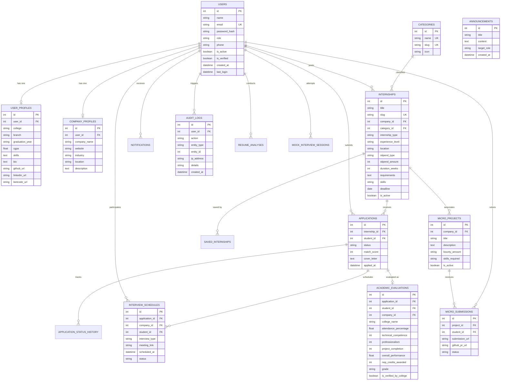

# TELEPORTAL Entity Relationship Diagram (ERD)

The following diagram illustrates the relational data model of TELEPORTAL, capturing all 15 core entities, foreign key dependencies, and cardinalities.

